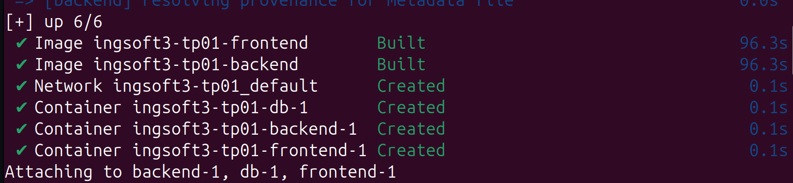
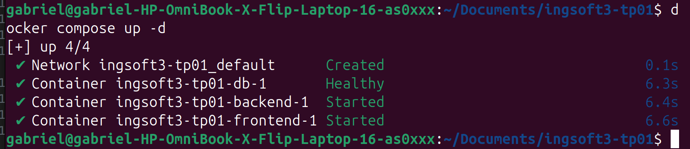
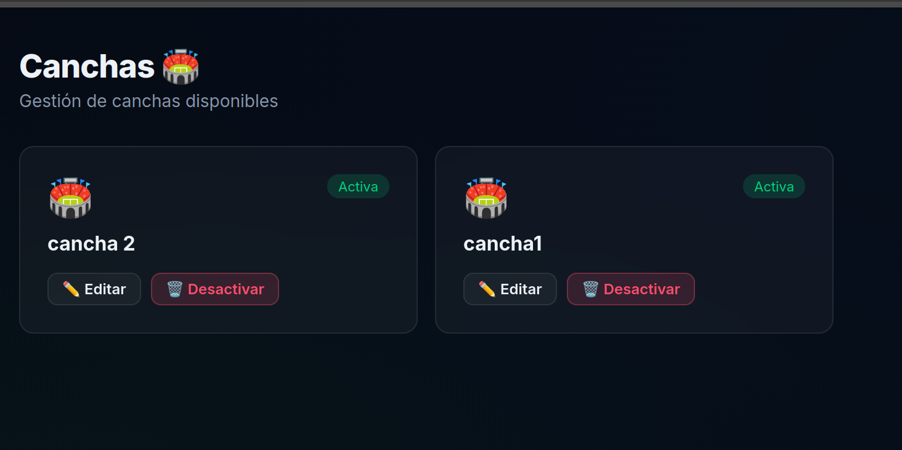
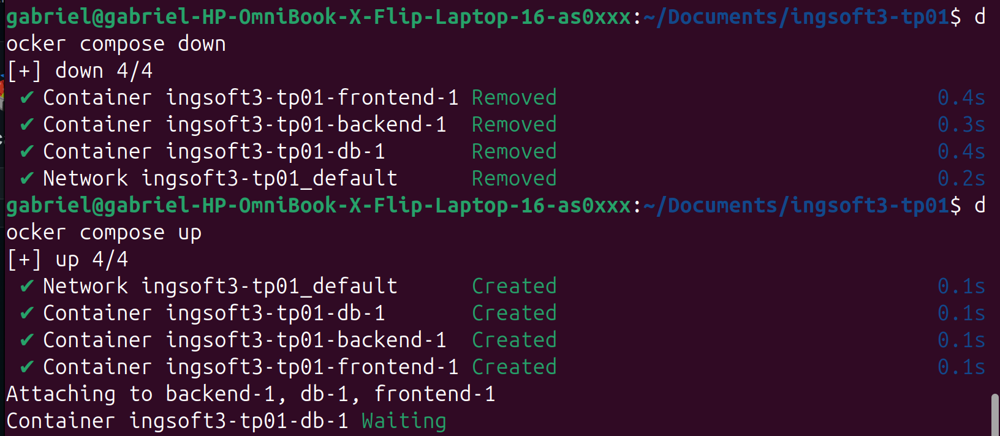
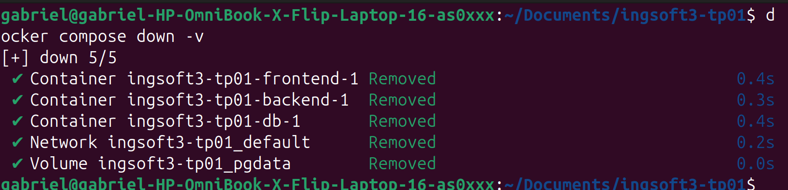
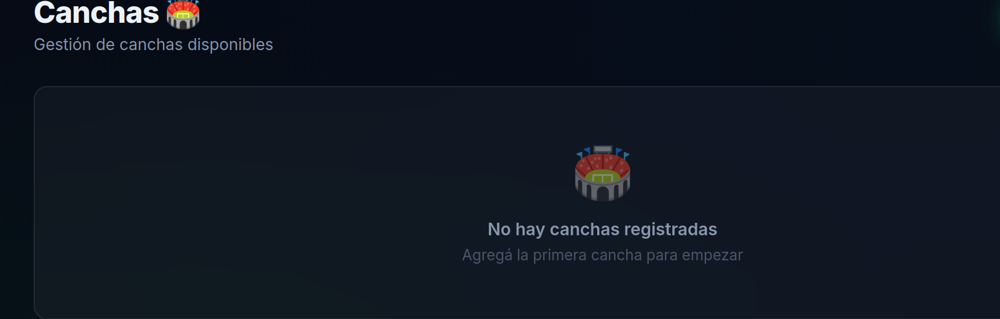
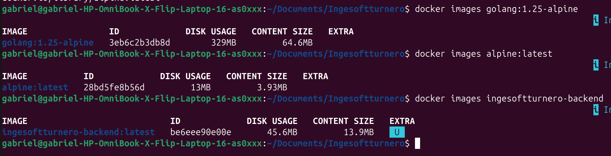
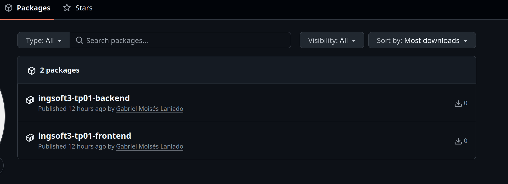

# Evidencias — TP1

## 1. Push directo a main rechazado

GitHub rechaza el push porque main está protegida y la regla alcanza también al dueño del repo.

## 2. El PR de la rama B no se puede mergear: conflicto

Se genera un conflicto porque se intenta mergear en main dos ramas que parten del mismo commit y que modifican la misma linea.

## 3. Los marcadores del conflicto

GitHub permite visualizar el editor de conflictos con la version de la rama actual y la que está en main seprados por ====

## 4. La release v1.0.0 publicada

Se creó una release a partir del tag creado desde la terminal que nos indica cuál es la version para hacer el release.

# Evidencias — TP2

## 1. docker compose up -d desde cero
 
Se inicia el sistema desde cero.

 
Se inicia el sistema en modo detached.
## 2. Prueba de persistencia

Se crean canchas y datos desde la aplicación web para probar la persistencia.

Se bajan los contenedores con `docker compose down` y al volver a levantarlos los datos persisten gracias al volumen montado de PostgreSQL.

Se ejecutan los contenedores deteniéndolos con la opción `-v` (`docker compose down -v`) para eliminar los volúmenes asociados.

Se verifica la eliminación del volumen y que la base de datos se reinicializa limpiamente.

## 3. Comparación de tamaño imagen final vs imagen de SDK

Se puede observar claramente la diferencia de tamaño entre la imagen final y la imagen de SDK.  

## 4. Imágenes publicadas en el registry.

