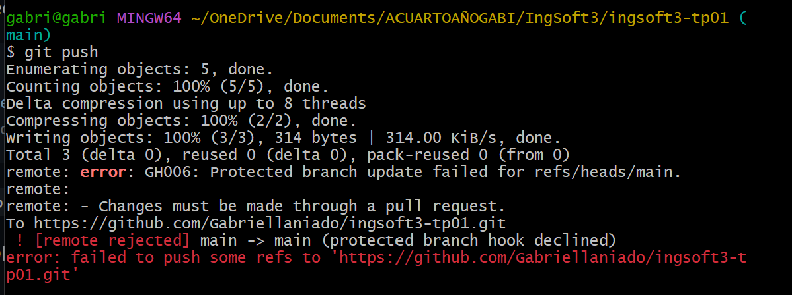
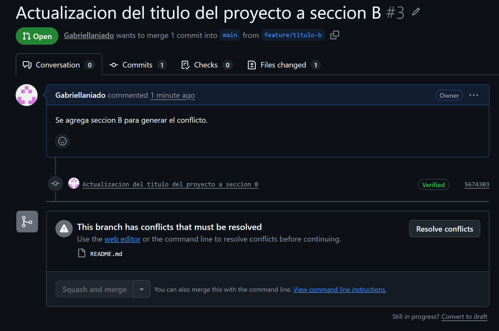
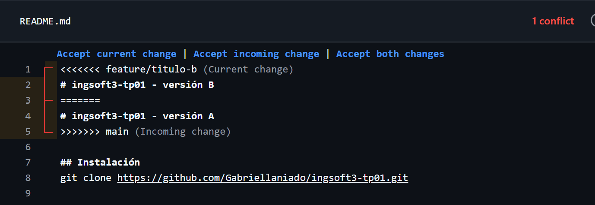
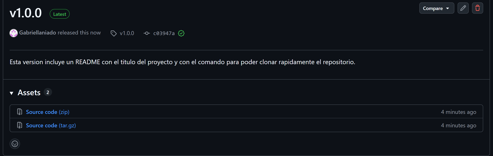

# Evidencias — TP1

## 1. Push directo a main rechazado

GitHub rechaza el push porque main está protegida y la regla alcanza también al dueño del repo.

## 2. El PR de la rama B no se puede mergear: conflicto

Se genera un conflicto porque se intenta mergear en main dos ramas que parten del mismo commit y que modifican la misma linea.

## 3. Los marcadores del conflicto

GitHub permite visualizar el editor de conflictos con la version de la rama actual y la que está en main seprados por ====

## 4. La release v1.0.0 publicada

Se creó una release a partir del tag creado desde la terminal que nos indica cuál es la version para hacer el release.
